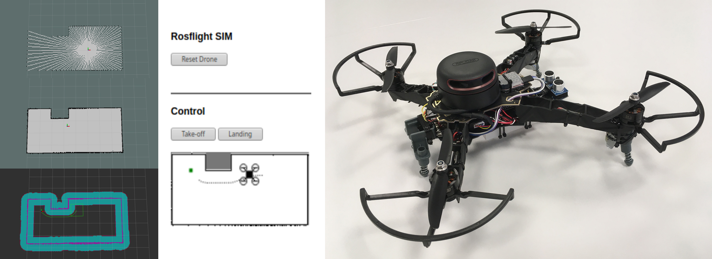

# Autonomous Indoor Drone

The goal of this project was to realize an autonomous flying indoor drone.

## Info

The simulation works (only in a fixed horizontal plane), tests on the real drone failed so far, due to problems with FCs, PID-settings and lack of time.

#### Software

This project uses [ROS](https://www.ros.org/) and [ROS-Flight](https://rosflight.org/) for sensing and drone control, [Gazebo](http://gazebosim.org/) for simulation, and [ROS-navigation](https://wiki.ros.org/navigation) with [ROS-hector-mapping](https://wiki.ros.org/hector_mapping) for SLAM. The Web-UI is realized with a [Simple Websocket Server](https://github.com/pikhovkin/simple-websocket-server) in python.

#### Hardware

The drone was built with a [Naze32 (F1)](https://www.dronetrest.com/t/naze-32-revision-6-flight-controller-guide/1605) / [REVO (F4)](http://copterjungle.de/f4-revo-stm32f405-flight-controller/) as FC, a [NanoPi Neo Air](https://www.friendlyarm.com/index.php?route=product/product&product_id=151) for onboard computation. A [RPILIDAR A2](https://www.slamtec.com/en/Lidar/A2) is used for horizontal and two [HC-SR04](https://www.sparkfun.com/products/15569) ultrasonic sensors for vertical measurements.

## Structure

- [AMS-CC](https://bitbucket.org/ams2019/ams-cc): This repository contains scripts and configurations for the companion computer.
- [AMS-FC](https://bitbucket.org/ams2019/ams-fc): This repository contains firmware and parameters used for the flight controller of the drone.
- [AMS-MAIN](https://bitbucket.org/ams2019/ams-main): This repository contains all code used for mapping, calculations and controls of the drone.
- [AMS-SENS](https://bitbucket.org/ams2019/ams-sens): This repository contains all code used for sensor reading and actuator controlling.
- [AMS-SIMU](https://bitbucket.org/ams2019/ams-simu): This repository contains all code used for simulation of the drone with gazebo.

## Installation

The following repositories are necessary depending on what goal should be achieved:

- Drone Simulation with gazebo: `ams-main`, `ams-simu`
- Autonomous Flight with real drone: `ams-cc`, `ams-fc`, `ams-sens`, `ams-main`

Please follow the instructions of each repository in the given order when trying to rebuild one of the above scenarios.

## Documentation

Feel free to download the [documentation](docs/project-documentation.pdf) and final [presentation](docs/end-presentation.pdf) of this project.

## Members

This project was created by `Team IMP` in the course `AMS` (Special Aspects on Mobile Autonomous Systems) in the term 19/20 at `TH Köln` supervised by [Prof. Dr.-Ing. Chunrong Yuan](https://www.th-koeln.de/personen/chunrong.yuan/).

## License

🍺 BEERWARE 🍺  
As long as you retain this notice you can do whatever you want with this stuff. If we meet some day, and you think this stuff is worth it, you can buy me a beer in return.

## Related Projects

Have a look at the Project `A Fully Autonomous Indoor Quadrotor` from UNI Freiburg. It is a similar project with links and videos on this [website](http://ais.informatik.uni-freiburg.de/projects/quadrotor/) and more detailed information in this [paper](http://www.slawomir.de/publications/grzonka12tro_quad/grzonka12tro_quad.pdf).
